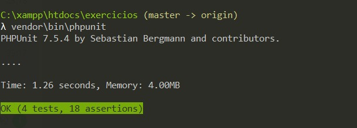

<h5>Clonar Repositório</h5>
<h6>SSH</h6>
<pre>
    git clone git@github.com:klzchz/test-Just.git
</pre>
<h6>HTTPS</h6>
<pre>
    git clone https://github.com/klzchz/test-Just.git
</pre>

<h5>Instalar as dependências via composer</h5>
<pre>composer install</pre>

<h5>Testar a Classe src/Prova com o namespace App</h5>
<pre>vendor\bin\phpunit.bat</pre>
<small>Windows</small>
<pre>vendor\bin\phpunit</pre>
<small>Global</small>

<h6>Resultado dos testes</h6>

